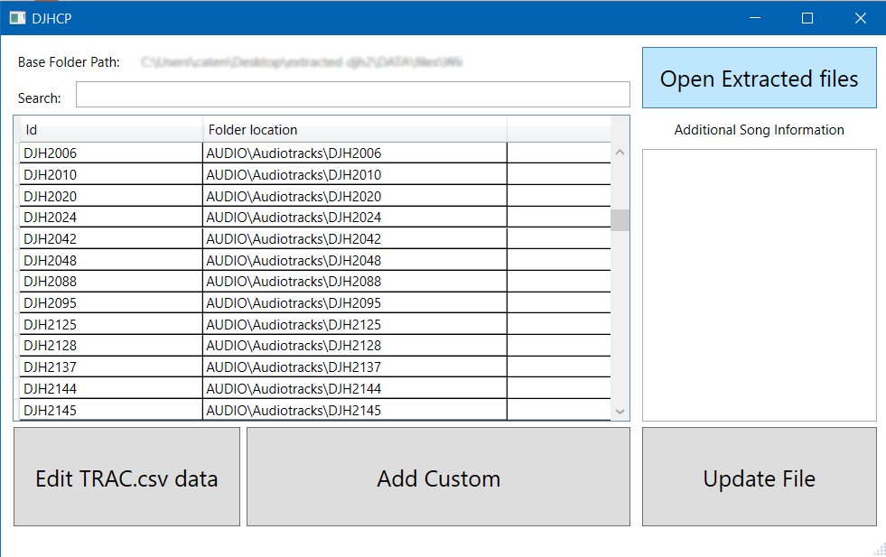

# DJHCP General guide

DJHCP (**DJ H**ero **C**ontrol **P**anel) is a tool by MatteoGodzilla to organise customs, generate track listing XML files and to find the song id from the text entries. It currently only supports Windows natively.

## How to install

Download and extract the latest zip on [MatteoGodzilla/DJHCP/releases](https://github.com/MatteoGodzilla/DJHCP/releases) (latest version at the time of writing: v4.0).
Every library is included inside the zip.

## Usage

This is the main screen of DJHCP, where everything happens. In order:
1. Search bar to search for songs based from their id or from the string data referenced from the track entry
2. "Open Extracted Files" button. Must be pressed every single time to be able to modify the data
3. Currently loaded tracks. Shows only the id and the folder path
4. Additional song information, such as names, artists, bpm, difficulty and more
5. String data editor/viewer.
6. "Add Custom" button.
7. "Update files" button. Must be pressed to actually write the changes to the files

### How to install a custom

**!DISCLAIMER!: DJHCP only works with extracted and visible files from the original Dj Hero games. This readme does not include a guide on how to do that.**

**If you haven't started yet and want to try customs, DJHCP has been tested and is fully working under/with Dj Hero 2 game files. Compatibility for the first Dj Hero is NOT guaranteed**

First, click the "Open extracted files" button. This will open a dialog where you can choose a folder. Navigate to the extracted game files and open the WII,PS3 or X360 folder inside DATA\files.

This will be referenced in the guide as "Load the extracted files"

After that, if djhcp can open the files, you'll be greeted with something like this. 

Entries inside the track list don't need to be the exact same one as shown. The important thing is if DJHCP loadeded successfully the tracks.

From this point you can add a custom in 2 ways:
  * drag&drop the "DJH2\info for tracklisting.xml" file from the customs' folder on top of the "Add Custom button"
  * Clicking the Add Custom button, then opening the same file from the dialog that appears.
  
After these, DJHCP will try to add the song to the tracklist, copy the files from the custom to AUDIO\Audiotracks and add the linked string data to the dictionary. If the custom's files are already present in the destination folder (because you added them manually or you added that custom before), DJHCP will warn you about it.

You can add as many customs as you want.

When you want to apply the changes, just click the "Update File" button on the bottom right.

If everything worked, you just added a custom to the game. 👏Congratulations👏

### How to remove a custom

Load the extracted files, then just select the custom you want to delete and press delete on the keyboard. Confirm the remove by clicking yes on the dialog.

### How to edit string data

Load the extracted files, then press the "Edit Trac.csv data" Button. this will open a simple dialog where you can view/edit string data to fix !MISSING! inside the game. This is not easy and you should ask in the discord server for help.
